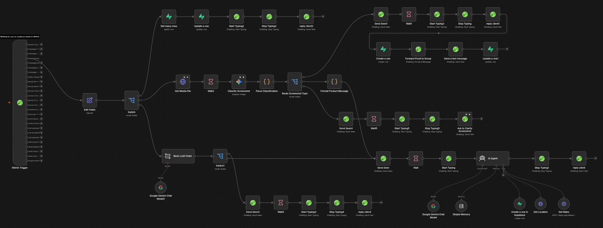
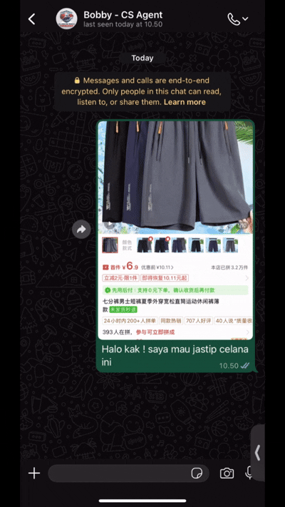

# WhatsApp Cross-Border Logistics Automation

An enterprise-grade, event-driven n8n workflow that automates WhatsApp customer inquiries, AI-powered product extraction, dynamic logistics pricing, and order management for cross-border shopping (Jastip & Import Services).

---


# Workflow Overview

| Architecture | Live Demo |
|--------------|-----------|
|  |  |

## Full Video Demonstration

Watch the complete workflow here:

https://drive.google.com/file/d/19FApeRaioo1X_fEaq09dBFPAEEepXqeJ/view?usp=sharing

---

This project is built around an **Event-Driven Architecture (EDA)** using **n8n** as the orchestration engine. Incoming WhatsApp messages are intelligently classified before reaching the AI agent, significantly reducing LLM usage while maintaining a seamless customer experience.

The system is capable of:

- Receiving WhatsApp messages through WAHA
- Understanding customer intent
- Extracting products from screenshots using AI Vision
- Detecting payment receipts
- Calculating shipping costs automatically
- Managing conversational state
- Persisting order information into Supabase
- Sending notifications to administrators

---

# System Architecture

```text
                    WhatsApp Customer
                           │
                           ▼
                  WhatsApp Webhook (WAHA)
                           │
                           ▼
              Advanced Intent Triage Layer
                           │
        ┌──────────────────┴──────────────────┐
        │                                     │
        ▼                                     ▼
 Simple Intent                        Image Payload
(Greetings/Test)                      (Photo Upload)
        │                                     │
        ▼                                     ▼
 Instant Response                 Gemini Vision Classifier
                                          │
                    ┌─────────────────────┴─────────────────────┐
                    ▼                                           ▼
            Product Extraction                     Payment Receipt Detection
                    │                                           │
                    └─────────────────────┬─────────────────────┘
                                          ▼
                              AI Agent Core Orchestrator
                                          │
              ┌───────────────────────────┴───────────────────────────┐
              │                                                       │
              ▼                                                       ▼
      Get Exchange Rate & Address                          Shipping Rate Engine
       (Google Sheets / Backup)                              (Biteship API)
              │                                                       │
              └───────────────────────────┬───────────────────────────┘
                                          ▼
                           State Management (Supabase)
                                          │
                                          ▼
                             WhatsApp Admin Notification
```

---

# Workflow Pipeline

1. Customer sends a WhatsApp message.
2. The webhook receives the event.
3. The Intent Triage Layer determines whether the message requires AI.
4. Greetings and simple conversations are answered instantly.
5. Image messages are routed to Gemini Vision.
6. Product screenshots are parsed into structured data.
7. Payment receipts are detected and forwarded for manual verification.
8. Complex logistics requests are handled by the AI Agent.
9. Shipping rates are calculated through Biteship.
10. Currency rates and destination data are retrieved.
11. Order state is saved into Supabase.
12. Admins receive notifications through a WhatsApp group.

---

# Architecture Highlights

## 1. Two-Tier Intent Triage

To reduce LLM cost and latency, the workflow introduces an optimization layer before the main AI agent.

### Tier 1

Handles low-value requests such as:

- Greetings
- Testing messages
- Emoji
- Single characters

These requests never invoke the expensive AI agent.

### Tier 2

Only complex logistics conversations are forwarded to the AI Agent.

Benefits:

- Lower token consumption
- Faster response times
- Reduced operational cost

---

## 2. AI Vision Pipeline

The workflow supports multiple vision-based use cases.

### Product Extraction

Automatically extracts:

- Product name
- RMB price
- Marketplace information

Supported marketplaces include:

- Taobao
- 1688
- Alibaba

### Payment Verification

Incoming images are classified to detect payment receipts.

When a receipt is detected:

- AI conversation is paused
- Customer receives confirmation
- Admin is notified for manual settlement verification

---

## 3. Dynamic State Management

The workflow behaves as a finite-state machine.

Before shipping calculation, it ensures all required information has been collected.

Required information includes:

- Destination
- Shipping method
- Weight
- Exchange rate
- Product value

The workflow supports asynchronous conversations, allowing customers to provide information over multiple messages.

---

## 4. Heavy Cargo Protection

Large shipments require manual quotation.

If:

```text
Weight > 11 kg
```

The workflow automatically:

- skips automated pricing
- changes order status to `PENDING_ADMIN`
- notifies the logistics team

This prevents inaccurate quotations for wholesale cargo.

---

# Tech Stack

| Category | Technology |
|-----------|------------|
| Workflow Automation | n8n |
| AI Models | Google Gemini Pro |
| Vision Model | Gemini Vision |
| Database | Supabase PostgreSQL |
| Messaging Gateway | WAHA |
| Shipping API | Biteship |
| Exchange Rate | Live Exchange Rate API |
| Spreadsheet Backup | Google Sheets |

---

# Features

| Feature | Description |
|----------|-------------|
| AI Intent Routing | Filters conversations before reaching the main AI |
| Vision Product Recognition | Reads product screenshots automatically |
| Receipt Detection | Identifies bank transfer receipts |
| Shipping Calculator | Calculates logistics costs automatically |
| Live Exchange Rates | Converts RMB to IDR |
| Context Memory | Maintains customer state across messages |
| Admin Notification | Sends WhatsApp alerts |
| Failover Backup | Falls back to local datasets if APIs fail |
| Address Validation | Validates Indonesian subdistricts (Kecamatan) |

---


Create the following environment variables before deployment.

```env
GEMINI_API_KEY=

SUPABASE_URL=

SUPABASE_SERVICE_ROLE_KEY=

BITESHIP_API_TOKEN=

WAHA_API_URL=

WAHA_API_KEY=
```

---

# Deployment

## 1. Import Workflow

Import the production workflow JSON into your n8n instance.

---

## 2. Configure Environment Variables

Set all required API keys.

---

## 3. Configure WAHA

Connect the WhatsApp webhook to the n8n Webhook node.

---

## 4. Configure AI Agent

Load the production system prompt into the AI Agent node.

The prompt is optimized to:

- prevent prompt injection
- minimize token usage
- keep responses concise
- preserve conversation state

---

## 5. Connect External Services

- Supabase
- Google Sheets
- Biteship API
- Exchange Rate API

---

# Reliability Features

- Event-driven workflow architecture
- Stateful conversations
- AI token optimization
- External API fallback
- Automatic retry handling
- Manual escalation for exceptional cases
- Receipt verification workflow
- Dynamic address validation

---

# Example Customer Journey

```text
Customer
    │
    ▼
Sends product screenshot
    │
    ▼
Gemini Vision extracts:

• Product Name
• RMB Price
    │
    ▼
AI asks:

• Destination
• Shipping Method
• Estimated Weight
    │
    ▼
Shipping cost calculated
    │
    ▼
Invoice generated
    │
    ▼
Customer uploads payment receipt
    │
    ▼
Receipt detected
    │
    ▼
Admin notified
    │
    ▼
Order updated in Supabase
```

---

# License

This project is licensed under the **MIT License**.

See the `LICENSE` file for more information.

---


